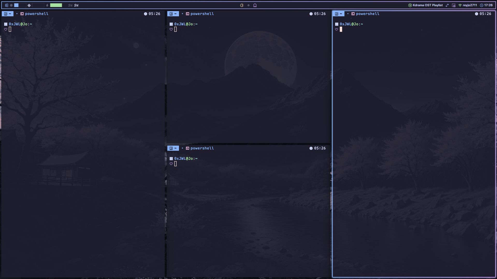

# Tacky-Borders

Bring sleek, customizable borders to your Windows desktop.

Use the original [tacky-borders](https://github.com/lukeyou05/tacky-borders) please!

https://github.com/user-attachments/assets/6520880d-b831-4652-b19d-34aa9b07f7cb

## Installation

### Download Prebuilt Release
1. Visit the [Releases](https://github.com/GlazeBar/tacky-borders/releases) page.
2. Download your desired version.
3. Unzip the file and run the `.exe` file.

Upon the first run, `tacky-borders` will generate a configuration file located at ```%userprofile%/.config/tacky-borders/```.

### Build it Yourself
If you'd like to build the application manually:

1. Ensure you have the following tools installed:
    - [Rust](https://www.rust-lang.org/tools/install)
    - [MSVC](https://visualstudio.microsoft.com/downloads/)

2. Clone this repository:

    ```bash
    git clone https://github.com/0xJWLabs/tacky-borders.git
    ```

3. Navigate into the project directory:

    ```bash
    cd tacky-borders
    ```

4. Build or run the project:

    ```bash
    cargo build --release
    ```

    or

    ```bash
    cargo run
    ```

## Configuration

The configuration file for Tacky Borders can be found in one of the following locations:

- `%USERPROFILE%/.config/tacky-borders/`
- `%USERPROFILE%/.tacky-borders/` (alternative location)

To easily modify the configuration, you can:

1. **Right-click** on the tray icon and select **"Open Config"**.
2. Use the `open_config` keybinding to open the configuration file directly.

The configuration file is auto-generated and named `config.jsonc` by default, but you can also use the following formats for your config file:

- **JSONC** (`config.jsonc`)
- **JSON** (`config.json`)
- **YAML** (`config.yaml`)

### Default Configuration

Here's an example of the default `config.jsonc`:

```jsonc
{
  "$schema": "https://raw.githubusercontent.com/0xJWLabs/tacky-borders/refs/heads/main/schema.json",
  // Enables automatic reloading when the configuration file is modified.
  // If set to `true`, the application will detect changes and apply them dynamically
  // without requiring a restart. Useful for rapid customization.
  "monitor_config_changes": true,
  // Specifies the theme file to be used for styling window borders.
  // This can be an absolute path or a theme name within `.config/tacky-borders/theme`.
  // If set to `null`, no theme will be applied, and the global settings will be used.
  "theme": null,
  "keybindings": {
    // Reload Keybinding:
    // - Defines the key used to reload the configuration.
    // - Default: "f8"
    // - Pressing this key applies any changes made to the config file.
    "reload": "f8",
    // Open Config Keybinding:
    // - Specifies the key to open the configuration file for editing.
    // - Default: "f9"
    // - Pressing this key should launch the default editor with this configuration file.
    "open_config": "f9",
    // Exit Keybinding:
    // - Defines the key that closes the application.
    // - Default: "f10"
    // - Pressing this key will terminate the running process.
    "exit": "f10"
  },
  "global": {
    // Border Width:
    // - Defines the thickness of the window border in pixels.
    // - Accepts both numerical values (e.g., `2`) and pixel-based strings (e.g., "2px").
    // - Example:
    //   - `2` -> 2px border thickness
    //   - "3px" -> 3px border thickness (equivalent to `3`)
    "border_width": 2,
    // Border Offset:
    // - Determines how much the border is shifted relative to the window edges.
    // - Negative values pull the border inward, reducing its visible area.
    // - Positive values push the border outward, making it appear larger.
    // - Accepts pixel-based strings (e.g., "-1px") in addition to numeric values.
    // - Example:
    //   - `-1` -> The border moves 1px inward.
    //   - `2` -> The border expands 2px outward.
    "border_offset": -1,
    // Border Style:
    // - Defines the shape and curvature of window corners.
    // - Possible values:
    //   - "Auto": Automatically determines a suitable radius.
    //   - "Round": Fully rounded corners.
    //   - "SmallRound": Slightly rounded corners.
    //   - "Square": No rounding (sharp corners).
    //   - "Radius(num)": Custom corner radius in pixels (e.g., "Radius(10)" for a 10px corner radius).
    "border_style": "Auto",
    // Active Window Border Color
    // - Specifies the border color for the active (focused) window.
    // - Acceptable formats:
    //   1. **String**:
    //    - Hex: "#RRGGBB" or "#RRGGBBAA".
    //    - CSS Functions: `rgb(...)` or `rgba(...)`.
    //    - Named Colors: Use predefined names from CSS (see: https://www.w3.org/TR/css-color-4/#named-colors).
    //    - Theme Reference: A color from the active theme.
    //   2. **Gradient Map**: Defines a linear gradient with the following properties:
    //    - `colors`: An array of color values (e.g., `["#89b4fa", "#cba6f7"]`).
    //    - `direction`: The start and end points of the gradient as normalized coordinates:
    //    - `start`: `[x, y]` (e.g., `[0.0, 0.0]`).
    //    - `end`: `[x, y]` (e.g., `[1.0, 0.0]`).
    // - Examples:
    //   - Single Color:
    //       active_color: "#ff0000"
    //   - Gradient Map:
    //     active_color: {
    //       "colors": ["#89b4fa", "#cba6f7"],
    //       "direction": {
    //         "start": [0.0, 0.0],
    //         "end": [1.0, 0.0]
    //       }
    //     }
    "active_color": {
      "colors": [
        "#000000",
        "#ffffff"
      ],
      "direction": {
        "start": [
          0.0,
          0.0
        ],
        "end": [
          1.0,
          0.0
        ]
      }
    },
    // Inactive Window Border Color:
    // - Works similarly to `active_color`, but applies to unfocused windows.
    "inactive_color": "#d2d2d2",
    // Animations
    // - Configures the animations applied to window borders.
    //   - active: Defines animations for active window transitions.
    //     - Each animation specifies its type (kind), duration, and easing function.
    //   - inactive: Defines animations for inactive window transitions.
    //     - Uses the same format as active animations.
    //   - fps: Sets the frame rate for animations (default: 60 FPS).
    // Example of an animation: { kind: "fade", duration: "450ms", easing: "EaseInOut" }
    //
    // Animation
    // - kind: Type of animation (e.g., "fade", "spiral", "reverse-spiral").
    //   - The `kind` value can be written in various casing conventions:
    //     - PascalCase (e.g., "Fade", "Spiral", "ReverseSpiral"): Common for classes or components.
    //     - camelCase (e.g., "fadeEffect", "spiral", "reverseSpiral"): Common in JavaScript for variable names and functions.
    //     - snake_case (e.g., "fade_effect", "spiral", "reverse_spiral"): Often used in Python or older codebases.
    //     - kebab-case (e.g., "fade-effect", "spiral", "reverse-spiral"): Common in CSS and HTML attributes.
    // - duration: Duration of the animation.
    //   - It can be represented as a number (for milliseconds) or a string with units:
    //     - A number (e.g., 450): Interpreted as milliseconds.
    //     - A string with "ms" (e.g., "450ms"): Specifies milliseconds.
    //     - A string with "s" (e.g., "3s"): Specifies seconds.
    // - easing: Easing function to control animation pacing.
    //   - Easing can be specified in various formats:
    //     - Common CSS easing functions (e.g., "ease-in", "ease-in-out", "ease-out", "linear").
    //     - Easing functions can be written in different casing conventions:
    //       - PascalCase (e.g., "EaseIn", "EaseInOut").
    //       - camelCase (e.g., "easeIn", "easeInOut").
    //       - snake_case (e.g., "ease_in", "ease_in_out").
    //       - kebab-case (e.g., "ease-in", "ease-in-out").
    //     - CSS `cubic-bezier()` function strings (e.g., "cubic-bezier(0.42, 0.0, 0.58, 1.0)").
    "animations": {
      "active": [
        {
          "kind": "fade",
          "duration": "450ms",
          "easing": "EaseInOut"
        },
        {
          "kind": "spiral",
          "duration": "1800ms",
          "easing": "cubic-bezier(0.42, 0.0, 0.58, 1.0)"
        }
      ],
      "inactive": [
        {
          "kind": "fade",
          "duration": "450ms",
          "easing": "ease-in-out"
        },
        {
          "kind": "reverse_spiral",
          "duration": "1800ms",
          "easing": "cubic-bezier(0.42, 0.0, 0.58, 1.0)"
        }
      ],
      "fps": 60
    },
    // Effects
    // - Configures the effects applied to window borders.
    //   - active: Defines effects for the active window.
    //     - Each effect specifies its type (kind), standard deviation (radius), opacity, and optional translation.
    //   - inactive: Defines effects for the inactive window.
    //     - Uses the same format as active effects.
    //   - enabled: Enable or disable effects.
    // Example of an effect: { kind: "glow", radius: "4px", opacity: 1.0 }
    //
    // Effect
    // - kind: Type of effect (e.g., "glow", "shadow").
    //   - The `kind` value can be written in various casing conventions:
    //     - PascalCase (e.g., "Glow", "Shadow"): Common for classes or components.
    //     - camelCase (e.g., "glow", "shadow"): Common in JavaScript for variable names and functions.
    //     - snake_case (e.g., "glow", "shadow"): Often used in Python or older codebases.
    //     - kebab-case (e.g., "glow", "shadow"): Common in CSS and HTML attributes.
    // - radius: The standard deviation (radius) for the effect (e.g., "4px", "10px", "2em").
    //   - The value can be a string with various units, such as:
    //     - px: pixels (e.g., "4px", "10px").
    //     - in: inches (e.g., "1in", "2in").
    //     - cm: centimeters (e.g., "2cm", "5cm").
    //     - mm: millimeters (e.g., "5mm", "10mm").
    //     - pt: points (e.g., "10pt", "12pt").
    //     - pc: picas (e.g., "1pc", "2pc").
    //     - em: relative to the font size (e.g., "2em").
    //   - It determines the size of the effect (e.g., the radius of a glow or shadow).
    // - opacity: Opacity of the effect, typically a value between 0.0 and 1.0 (e.g., "1.0", "0.5").
    //   - This value controls the transparency of the effect.
    // - translation: Defines translation (position offset) for the effect.
    //   - It can be represented in two ways:
    //     - As a string (e.g., "10px 20px", "-5px 10px").
    //     - Or as an object with `x` and `y` properties (e.g., { x: "10px", y: "5px" }, { x: "0", y: "10px" }).
    //       - Both `x` and `y` can be strings (e.g., `"10px"`, `"-5px"`, `"0"`, `"1in"`, `"2cm"`) or numbers (e.g., `0`, `10`).
    //       - The supported units for `translation` include:
    //         - px: pixels (e.g., "10px", "-5px").
    //         - in: inches (e.g., "0.5in", "-1in").
    //         - cm: centimeters (e.g., "2cm", "0.5cm").
    //         - mm: millimeters (e.g., "5mm", "-10mm").
    //         - pt: points (e.g., "10pt", "2pt").
    //         - pc: picas (e.g., "1pc", "0.5pc").
    //   - This defines the position shift for the effect, typically used for shadows or glows.
    // - enabled: A boolean value (true or false) that enables or disables the effect.
    //   - If set to `true`, the effect is applied; if `false`, the effect is disabled.
    "effects": {
      "active": [
        {
          "kind": "glow",
          "radius": "4px",
          "opacity": 1.0
        }
      ],
      "inactive": [
        {
          "kind": "glow",
          "radius": "4px",
          "opacity": 1.0
        }
      ],
      "enabled": true
    },
    // initialize_delay: The initial delay (in milliseconds) before applying animations when the window is first rendered. 
    //             A reduced delay can be used to account for animations like fade, which take additional time.
    // restore_delay: The delay (in milliseconds) before applying animations when a minimized window is restored.
    "initialize_delay": 150,
    "restore_delay": 100
  },
  // window_rules: Defines specific window matching rules for borders.
  // Each rule can define custom properties for how borders are applied to matching windows.
  // The properties defined in window_rules can either inherit from the global settings or be overridden by the rule.
  "window_rules": [
    {
      // Match Strategies:
      // kind: Specifies the type of property to match.
      // - Process: Matches based on the process name.
      // - Title: Matches based on the window title.
      // - Class: Matches based on the window's class name.
      // strategy (default: Equals):
      // - "Equals": The match value must be exactly equal to the specified value.
      // - "Regex": The match value must match the specified regular expression.
      // - "Contains": The match value must be a substring of the specified string.
      // value:
      // - Specifies the value against which the window's properties are matched.
      // - Can be a string that must either match exactly, be a substring, or conform to a regex pattern
      //   depending on the specified match strategy.
      // enabled (default: true):
      // - A boolean value indicating whether the border is enabled for this particular rule.
      // - If true, the defined border properties (such as color and thickness) will apply to matching windows.
      // - If false, no border will be applied, effectively disabling it for that rule.
      "match": {
        "kind": "Class",
        "value": "Windows.UI.Core.CoreWindow",
        "strategy": "Contains",
        "enabled": false
      }
    },
    {
      "match": {
        "kind": "Process",
        "value": "(?i)^Flow.*",
        "strategy": "Regex",
        "enabled": false
      }
    },
    {
      "match": {
        "kind": "Title",
        "value": "Zebar",
        "strategy": "Equals",
        "enabled": false
      }
    },
    {
      "match": {
        "kind": "Title",
        "value": "Picture-in-Picture",
        "strategy": "Equals",
        "enabled": false
      }
    },
    {
      "match": {
        "kind": "Class",
        "value": "XamlExplorerHostIslandWindow",
        "strategy": "Equals",
        "enabled": false
      }
    }
  ]
}
```

### Configuration Schema
To make customization easier, a [configuration schema](./schema.json) is available.

### Theme Configuration Guide
To make defining colors easier, themes can be used in Tacky Borders. Themes allow you to use predefined color names instead of manually specifying colors each time. You can define colors in various formats, including:

- `#RGB`
- `#RRGGBB`
- `rgb(...)`
- `hsl(...)`

**Example Theme Format**
Below is an example of a theme file:

```json
{
    "rosewater": "#f5e0dc",
    "flamingo": "#f2cdcd",
    "pink": "#f5c2e7",
    "mauve": "#cba6f7",
    "red": "#f38ba8",
    "maroon": "#eba0ac",
    "peach": "#fab387",
    "yellow": "#f9e2af",
    "green": "#a6e3a1",
    "teal": "#94e2d5",
    "sky": "#89dceb",
    "sapphire": "#74c7ec",
    "blue": "#89b4fa",
    "lavender": "#b4befe",
    "text": "#cdd6f4",
    "subtext1": "#bac2de",
    "subtext0": "#a6adc8",
    "overlay2": "#9399b2",
    "overlay1": "#7f849c",
    "overlay0": "#6c7086",
    "surface2": "#585b70",
    "surface1": "#45475a",
    "surface0": "#313244",
    "base": "#1e1e2e",
    "mantle": "#181825",
    "crust": "#11111b"
}
```

#### Storing Themes

Place your theme files in the following directory, depending on where your Tacky Borders configuration is located:

- If your config is in `%USERPROFILE%/.config/tacky-borders/`:
  - `%USERPROFILE%/.config/tacky-borders/themes/{theme-name}.json(c)`
  - `%USERPROFILE%/.config/tacky-borders/themes/{theme-name}.yaml`

- If your config is in `%USERPROFILE%/.tacky-borders/`:
  - `%USERPROFILE%/.tacky-borders/themes/{theme-name}.json(c)`
  - `%USERPROFILE%/.tacky-borders/themes/{theme-name}.yaml`

Replace `{theme-name}` with the name of your theme. You can use either **JSON** (`.json`), **JSONC** (`.jsonc`), or **YAML** (`.yaml`) formats for theme files.

## Screenshots


## Credits
This project makes use of the following open-source library:
- [Bezier-Easing](https://github.com/gre/bezier-easing) by Gaëtan Renaudeau

## License

This project is licensed under the MIT License. See the [LICENSE](./LICENSE) file for details.
